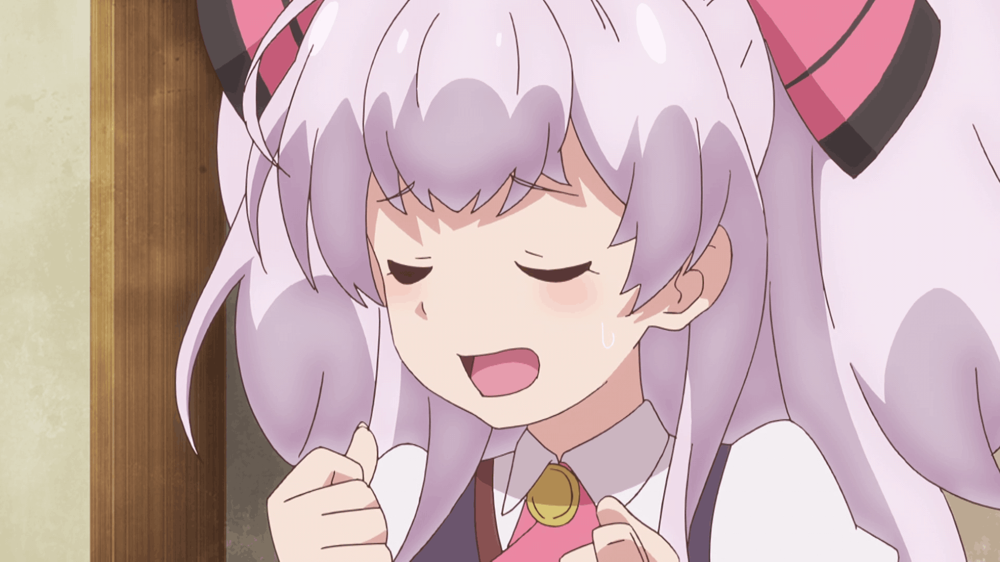
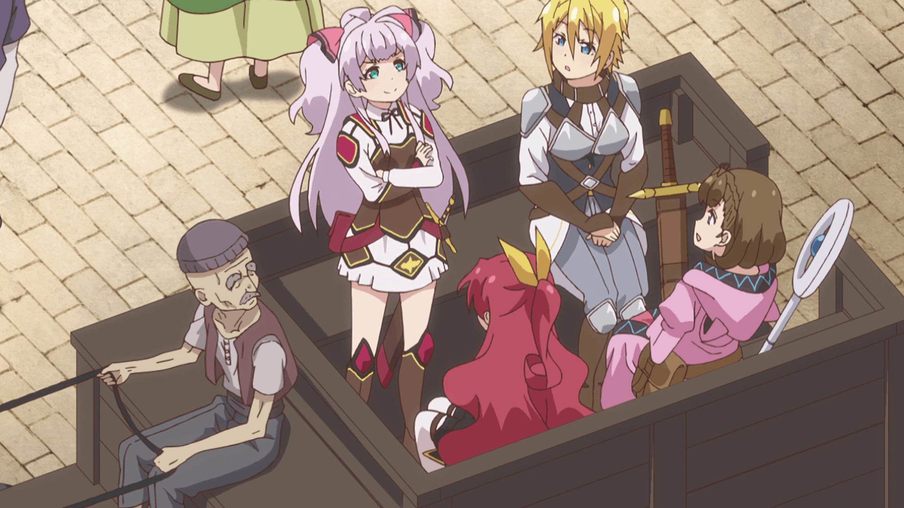

The thing with Noukin (the shortened Japanese name of this show that's a lot easier to write) is that it doesn't have a serious bone in its body. Not a single one. No matter what serious topic comes up, it'll top it off with some comedic relief and leave you feeling either uncomfortably unsatisfied, or, if you quickly came to like the characters like I did, with mixed feelings of genuine relief.

<figure>
  
  <figcaption>Noukin takes you on a comedic roller coaster of tension and quick relief.</figcaption>
</figure>

Ultimately, whether this technique works for you depends on how willing you are to accept it. It's perfectly fair to view Noukin as having no consistent tone, and unwilling to tell a meaningful story, but I don't really think that's the point. If you're looking for a serious and dramatic story about family, death, and friendship, well, this isn't the show for you.

<figure>
  
  <figcaption>Noukin is consistently funny if you like its sense of humour, but offers nothing more for those who don't.</figcaption>
</figure>

Noukin is a comedy through and through---and if you don't find the first couple of episodes funny, there's nothing more this show can offer you. If you do, however, it's an enjoyable ride. (If you're familiar with anime, you might recognise the director Oota Masahiko; this show is pretty similar to his other comedies.) The characters are likeable (if generally shallow and clichéd), its visuals are pretty (if not exactly beautiful), and it has most of the typical isekai trappings.

_Didn’t I Say to Make My Abilities Average in the Next Life?! is known as Watashi, nouryoku wa heikinchi de tte itta yo ne! in Japanese, and is often shorted to Noukin._
