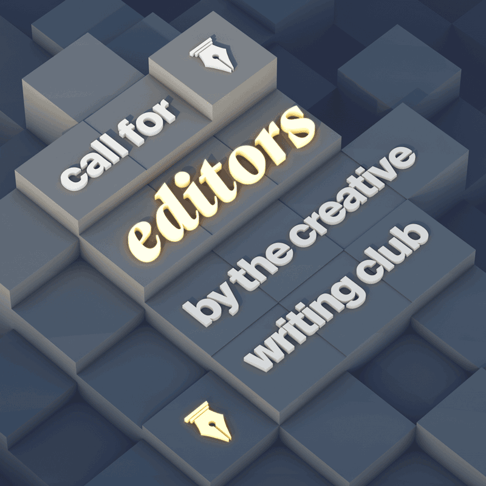

## Anthology project

The following are sets of promotional posters made for an anthology project by the group.

The first two are for the recruitment of editors for the project:

<figure>
  
  <figcaption>Square poster for digital distribution.</figcaption>
</figure>

<figure>
  
  <figcaption>Tabloid-sized poster for physical printing.</figcaption> 
</figure>

The next two are for the recruitment of writers:

<figure>
  
  <figcaption>Square poster for digital distribution.</figcaption>
</figure>

<figure>
  
  <figcaption>Square poster for digital distribution.</figcaption>
</figure>

The above images have been palette-reduced to reduce file size for web delivery. For higher-quality copies, please contact me at [contact@trnglina.org](mailto:contact@trnglina.org).
