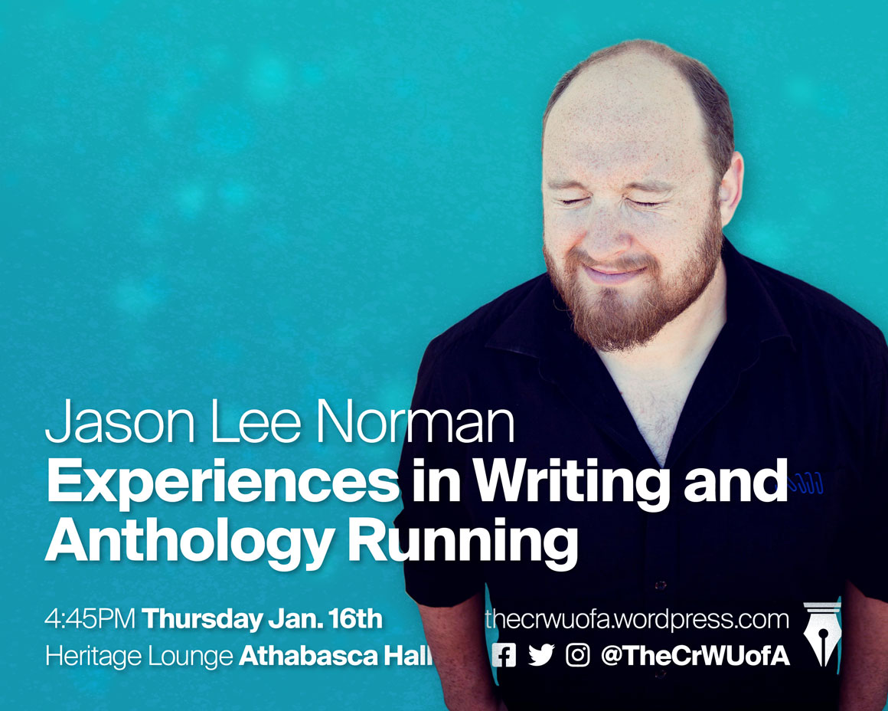
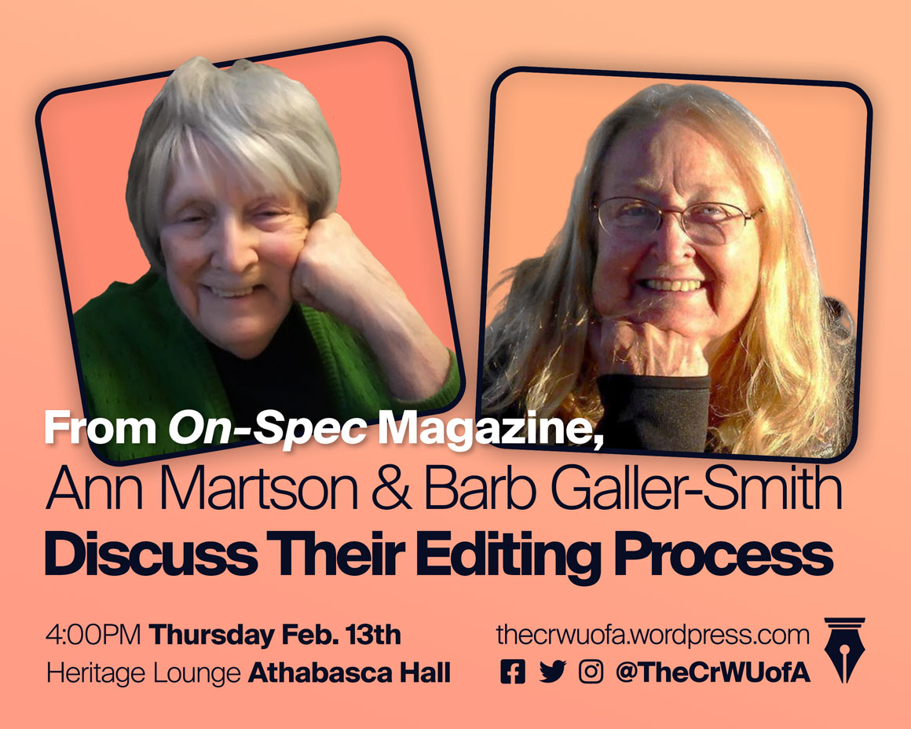
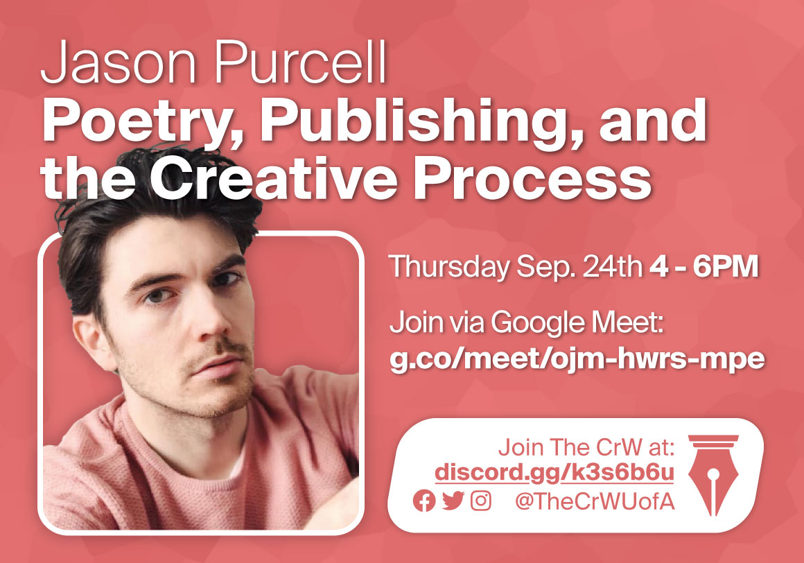
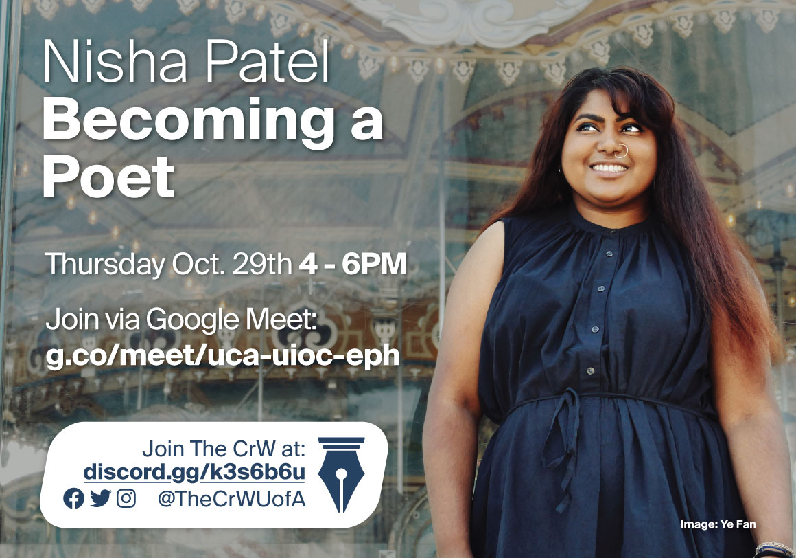
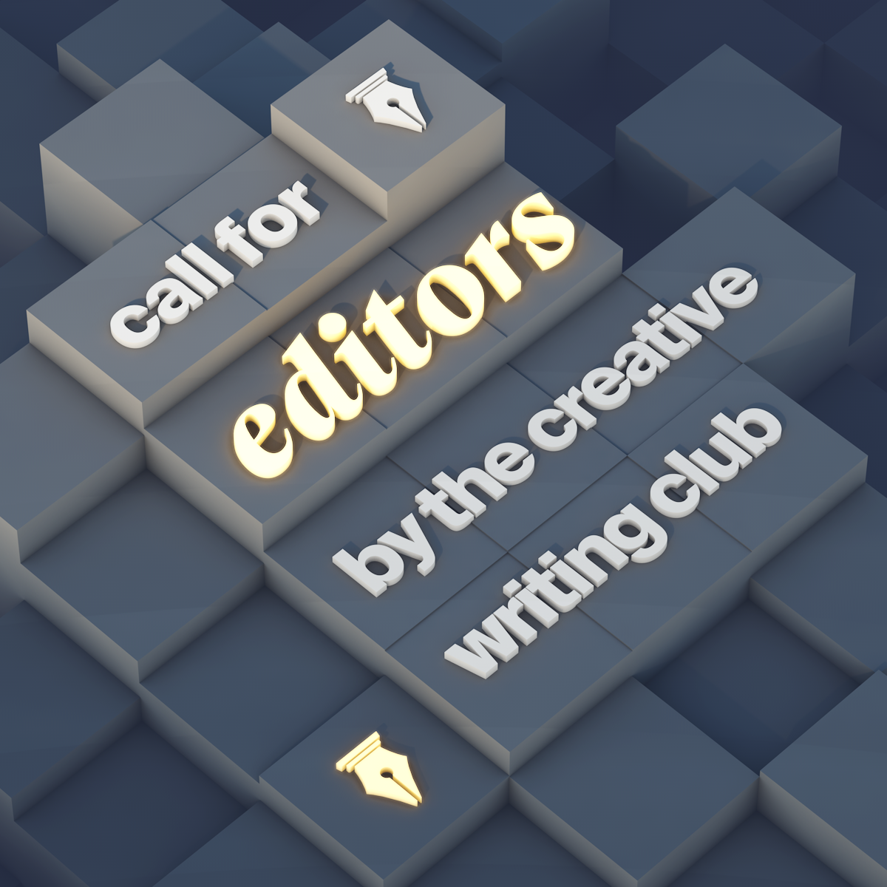
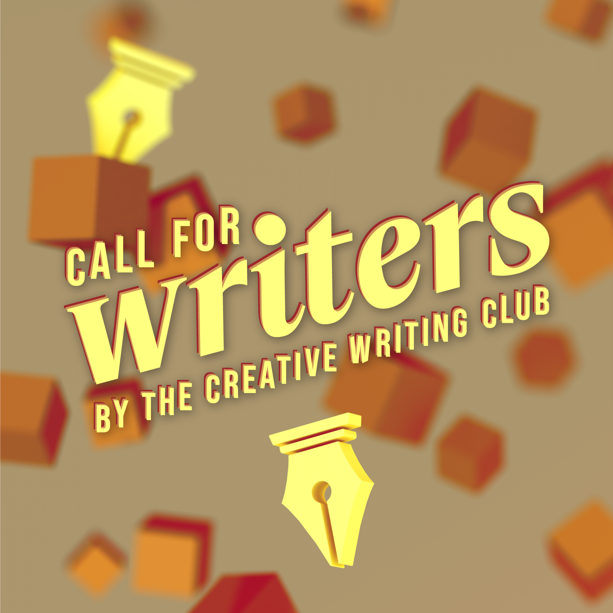

---
{
  'layout': 'portfolio',
  'date': '2019-12-09',
  'title': 'The CrW',
  'draft': false,
  'thumbnail': 'banner.png',
  'tags': ['Design'],
}
---

The CrW is the University of Alberta's Creative Writing Club—a social group for creative writers in the university and city.

## Guest Speaker Posters

The CrW often invites prominent figures in the local writing community to speak about their experiences and answer questions. I have helped create a set of promotional posters for these speakers for use on social media.

  

    <figure>
      
    </figure>
    <figure>
      
    </figure>
  

  

    <figure>
      
    </figure>
    <figure>
      
    </figure>
  

## Anthology Project

Starting in 2019, and progressing through 2020, the CrW produced a debut anthology featuring work by members of the club, and the greater university community. I played a role by creating posters for the purpose of recruiting editors and writers.

  

    <figure>
      
    </figure>
    <figure>
      
    </figure>
  

