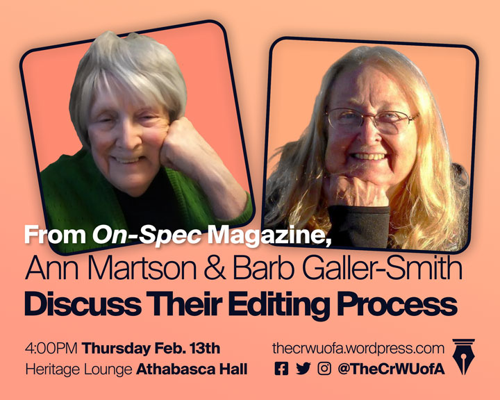
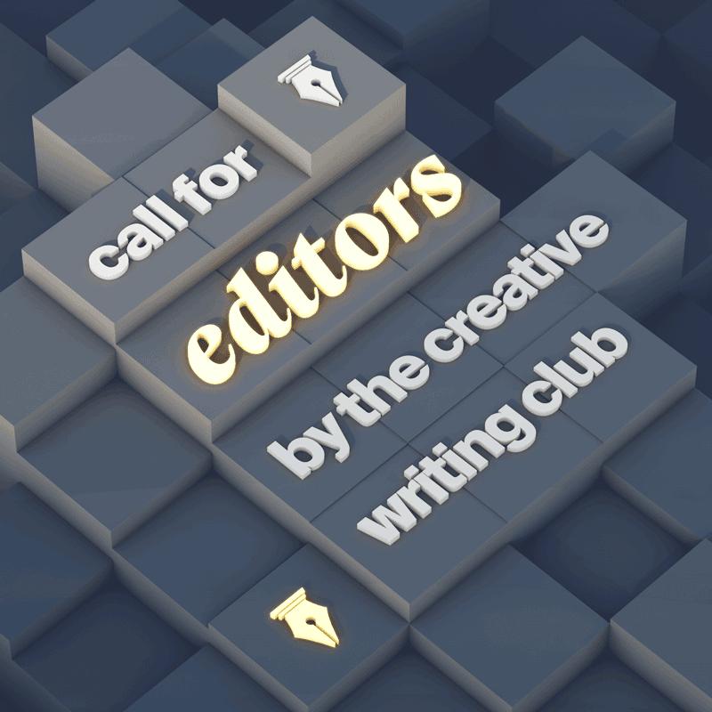
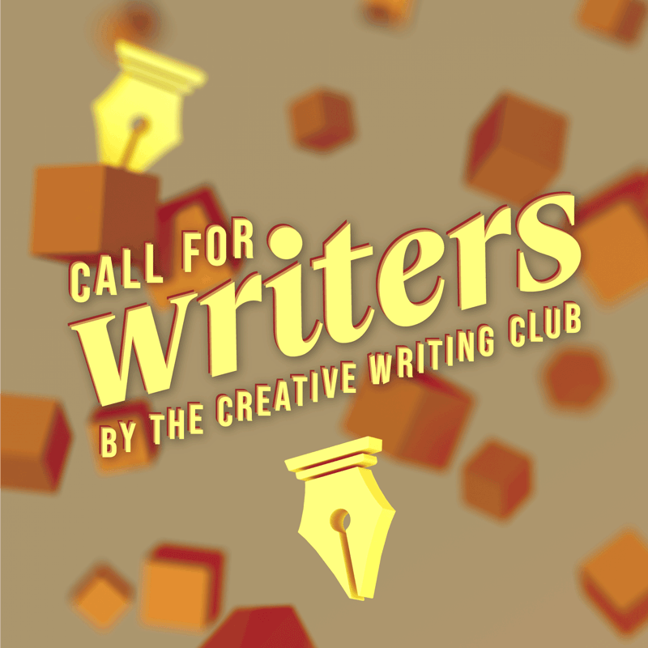

The CrW is the University of Alberta's Creative Writing Club—a social group for creative writers in the university and city.

## Guest speaker posters

The following are promotional posters made to announce and publicise guest speakers invited by the club.

<figure>
  
  <figcaption>Jason Lee Normal spoke on January 16th, 2020, about his experiences in writing and anthology running.</figcaption>
</figure>

These posters were created shortly before the events themselves, during the earlier months of 2020. They're designed with similar layouts, and with consistent design elements between them,

<figure>
  
  <figcaption>Ann Martson and Barb Galler-Smith from <em>On-Spec</em> Magazine, spoke on February 13th, 2020, about their editing process.</figcaption>
</figure>

As the group became unable to proceed with in-person meetings during the pandemic, however, guest speaking events also had to adapt. The following poster(s) put a greater focus on links to the club's online-based activities.

<figure>
  
  <figcaption>Jason Purcell participated in a remote meeting on September 24th, 2020, in which he spoke about poetry, publishing, and the creative process.</figcaption>
</figure>

## Anthology project

The following are sets of promotional posters made for an anthology project by the club.

The first two are designed for the recruitment of editors for the project:

<figure>
  
  <figcaption>Square poster for digital distribution.</figcaption>
</figure>

The background graphics are rendered in Maxon Cinema4D, while informational text is added using Adobe Photoshop.

<figure>
  
  <figcaption>Tabloid-sized poster for physical printing.</figcaption> 
</figure>

The next two are designed for the recruitment of writers for the project:

<figure>
  
  <figcaption>Square poster for digital distribution.</figcaption>
</figure>

The background graphics are rendered in Maxon Cinema4D. The headline "Call for writers by the Creative Writing Club" is laid-out in Adobe Illustrator, while informational text is added in Adobe Photoshop.

<figure>
  
  <figcaption>Tabloid-sized poster for physical printing.</figcaption>
</figure>

Some of the above images have been palette-reduced to reduce file size for web delivery. For higher-quality copies, please contact me at [contact@trnglina.org](mailto:contact@trnglina.org).
